# HRM System — 人力資源管理系統

## 項目簡介

定位：面向企業的人力資源管理系統前端應用，提供員工管理、考勤追蹤、薪資計算、績效評估、招聘流程、培訓管理等核心 HR 功能。

現代化全棧 Web 應用，採用 Nuxt 3 + Vue 3 + TypeScript 構建，整合 Supabase 後端服務。

**狀態**：該項目仍在開發中，已部署至 Cloudflare Pages。

## 技術棧

### 前端框架
- **Nuxt 4.4.8** — Vue 3 全棧框架，支援 SSR、自動路由、服務端 API
- **Vue 3.5.39** — Composition API + `<script setup>` 語法
- **TypeScript 6.0** — 嚴格型別檢查，型別安全

### 狀態管理
- **Pinia 3.0.4** — Vue 官方狀態管理庫
- **@pinia/nuxt** — Nuxt 整合，自動 imports

### UI 與樣式
- **TailwindCSS 4.3** — Utility-first CSS 框架
- **@tailwindcss/vite** — Vite 整合

### 後端服務
- **Supabase** — PostgreSQL 資料庫 + 即時 API + 認證服務
- **@supabase/supabase-js 2.106.2** — Supabase 客戶端 SDK

### 視覺化
- **ECharts 5.6** — 數據視覺化圖表庫
- **vue-echarts 7.0** — Vue 封裝組件

### 認證與安全
- **jsonwebtoken 9.0.3** — JWT Token 生成與驗證
- **bcryptjs 3.0.3** — 密碼加密（服務端）

### 開發工具
- **ESLint** — 代碼品質檢查
- **vue-tsc** — Vue TypeScript 類型檢查
- **Hono 4.12** — 輕量級服務端框架（開發環境）

## 功能預覽

以下是系統主要模組的界面預覽：

### 數據大盤

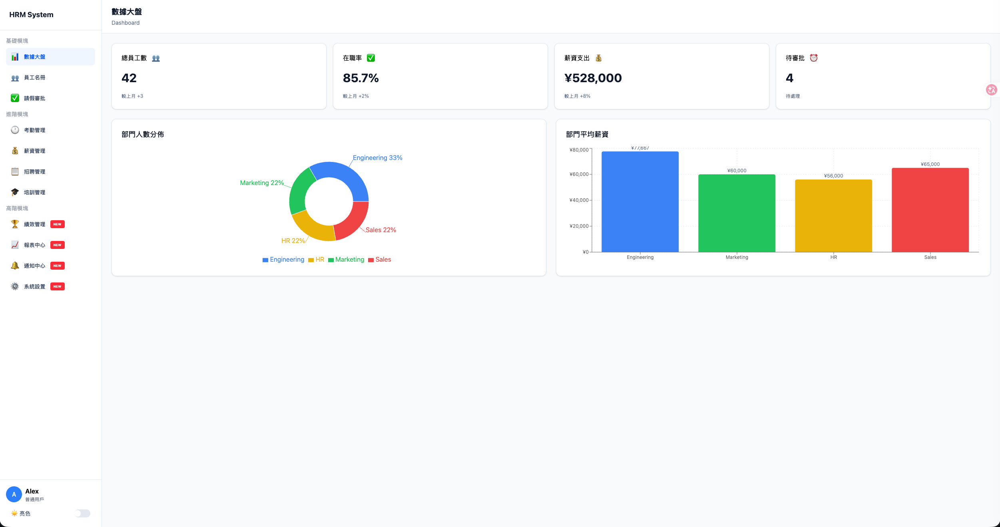

### 員工名錄

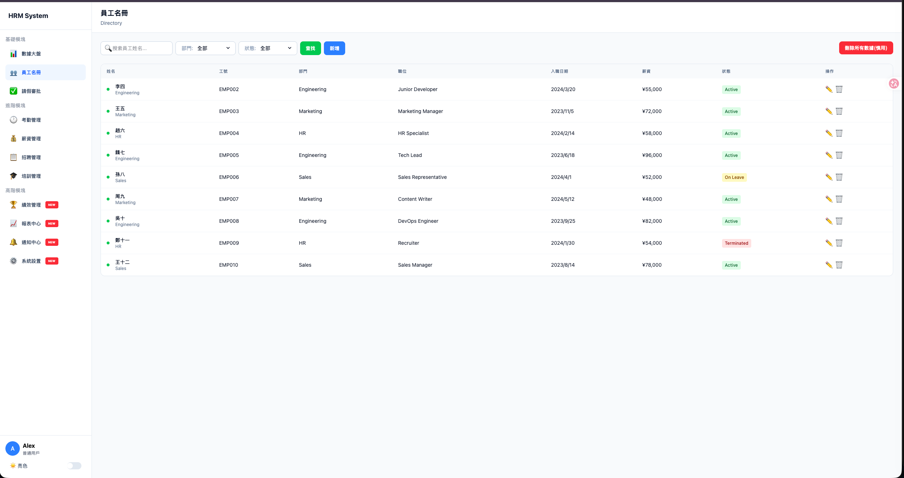

### 考勤管理

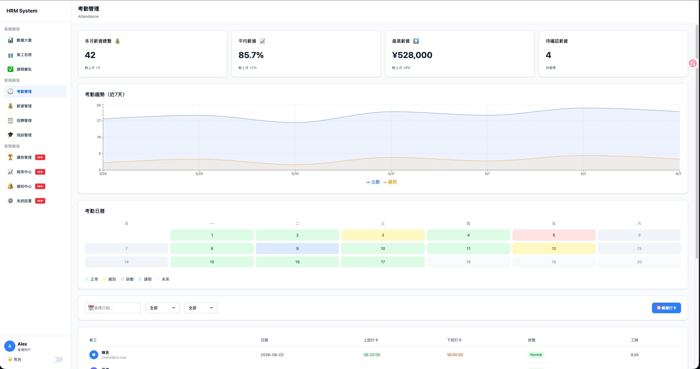

### 請假審批

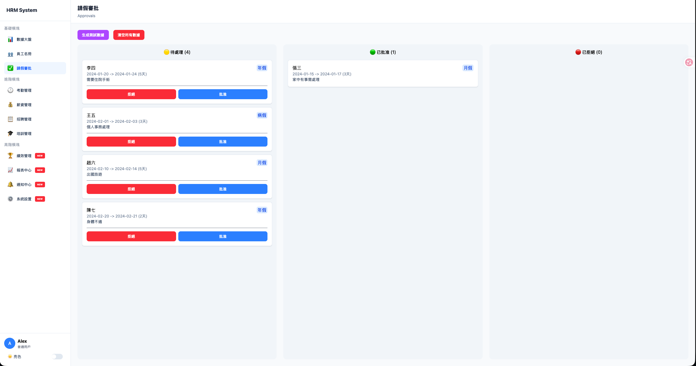

### 薪資管理

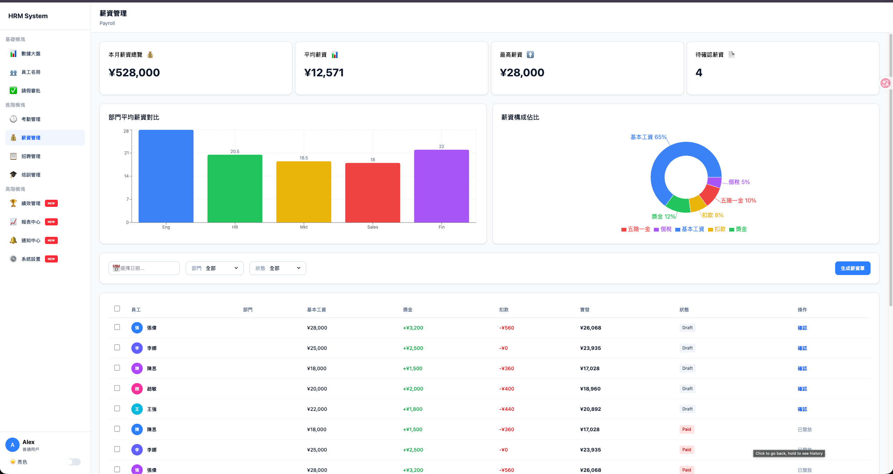

### 績效管理

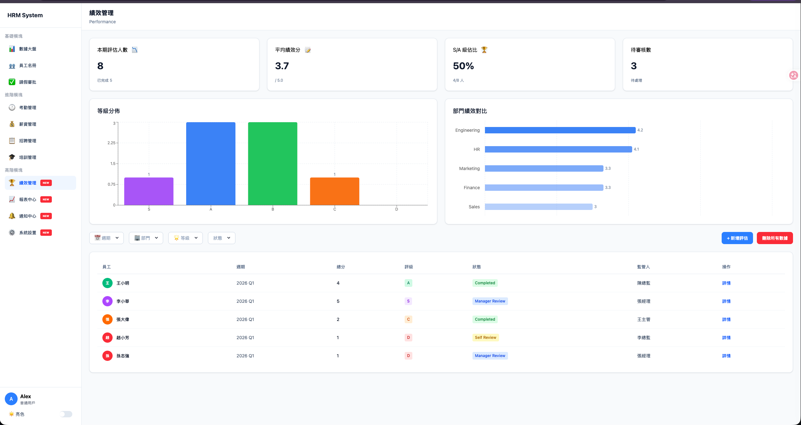

### 招聘管理

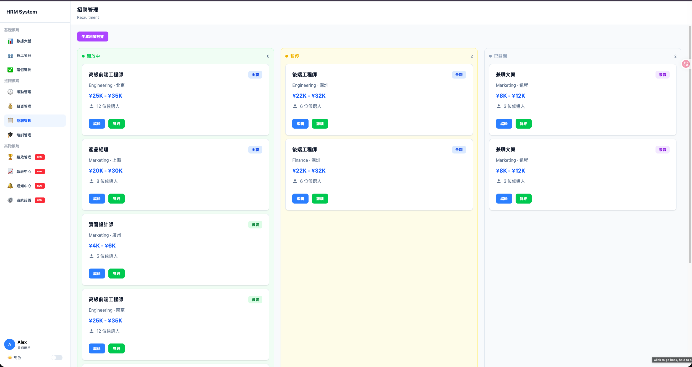

### 培訓管理

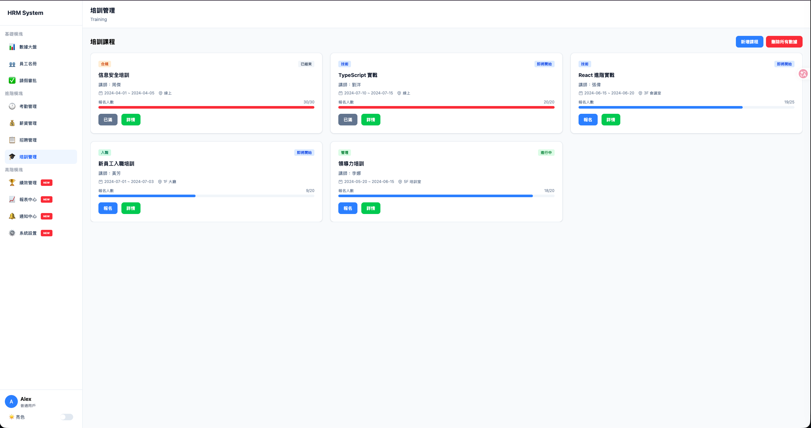

### 報表中心

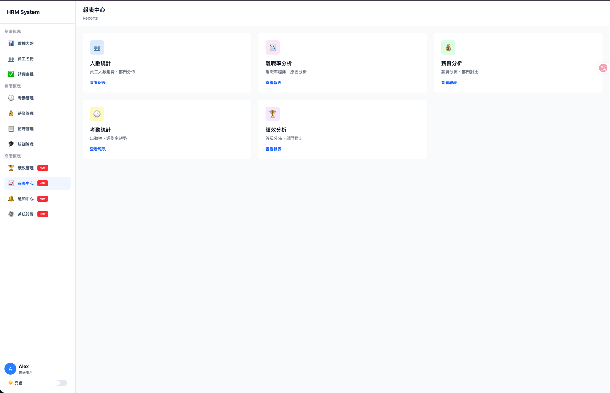

### 通知中心

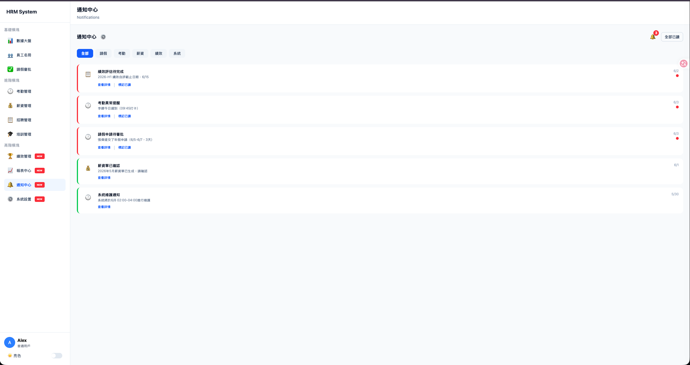

### 系統設置

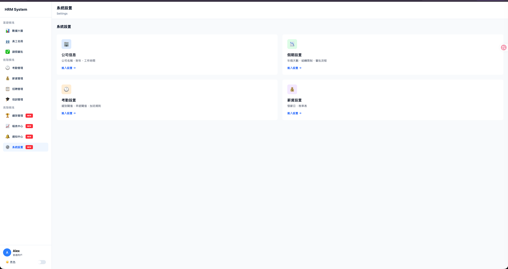

### 註冊頁面


### 其他

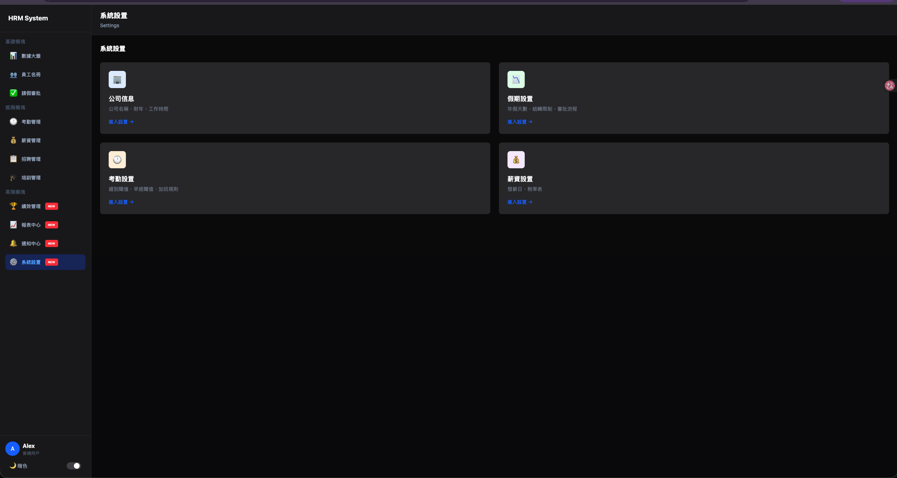

## 架構

採用 Nuxt 3 混合渲染架構，服務端與客戶端職責清晰分離：

```
hrm-nuxt/
├── app/                    # 客戶端應用
│   ├── components/         # Vue 組件（可複用 UI 元件）
│   ├── pages/              # 頁面路由（基於檔案系統自動路由）
│   ├── layouts/            # 佈局模板（default, mobile 等）
│   ├── composables/        # 組合式函數（API 封裝、主題切換）
│   ├── stores/             # Pinia 狀態管理（authStore 等）
│   ├── middleware/         # 路由中間件（auth.global.ts 全域認證）
│   ├── constants/          # 常量定義（選項配置、主題類別）
│   └── types.ts            # TypeScript 型別定義
├── server/                 # 服務端 API
│   ├── api/                # RESTful API 路由
│   │   ├── auth/           # 認證（登入、註冊、用戶資訊）
│   │   ├── employees/      # 員工管理 CRUD
│   │   ├── attendance/     # 考勤記錄
│   │   ├── payroll/        # 薪資管理
│   │   ├── performance/    # 績效評估
│   │   ├── recruitment/    # 招聘流程
│   │   ├── training/       # 培訓管理
│   │   ├── approvals/      # 審批工作流
│   │   └── dashboard/      # 數據統計儀表板
│   └── utils/              # 服務端工具（auth.ts, supabase.ts）
├── assets/css/             # 全局樣式
└── public/                 # 靜態資源
```

### 業務模組
- **員工管理** — 員工資訊增刪改查、批量操作
- **考勤系統** — 出勤記錄、日曆視圖、統計報表
- **薪資管理** — 薪資計算、明細查詢、批量導入
- **績效評估** — 評估記錄、數據生成、趨勢分析
- **招聘流程** — 職位管理、申請追蹤、狀態更新
- **培訓管理** — 課程安排、進度追蹤
- **審批工作流** — 待審、已審、拒絕狀態管理
- **儀表板** — 部門統計、薪資分佈圖表（ECharts 視覺化）

## 多環境與配置

### 環境變數（.env）
```bash
# Supabase 後端服務
SUPABASE_URL=your_supabase_url
SUPABASE_SERVICE_ROLE_KEY=your_service_role_key
SUPABASE_ANON_KEY=your_anon_key

# JWT 認證密鑰
JWT_SECRET=your_jwt_secret
```

### Nuxt Runtime Config
- **服務端私有配置** — `supabaseServiceRoleKey`, `jwtSecret`
- **客戶端公開配置** — `supabaseUrl`, `supabaseAnonKey`

### 構建與部署
```bash
# 開發環境
npm run dev              # 啟動開發伺服器 (http://localhost:3000)

# 類型檢查
npm run typecheck        # TypeScript 類型檢查

# 代碼品質
npm run lint             # ESLint 檢查

# 生產構建
npm run build            # Nuxt 構建
npm run preview          # 預覽生產構建
npm run generate         # 靜態站點生成
```

## 安全機制

### 認證與授權
- **JWT Token** — 服務端生成，包含用戶身份資訊
- **bcrypt 密碼加密** — 服務端密碼雜湊存儲
- **Supabase Row Level Security** — 資料庫層級權限控制

### 前端安全
- **全域認證中間件** — `auth.global.ts` 攔截未授權請求
- **環境變數管理** — `.env` 隔離機敏配置
- **Nuxt Runtime Config** — 服務端私有配置不暴露至客戶端

### API 安全
- **服務端 API 路由** — 敏感操作在服務端執行
- **Supabase Service Role** — 服務端專用金鑰，客戶端無法存取

---

**License**: Private Project
**Maintainer**: Carlos Suen